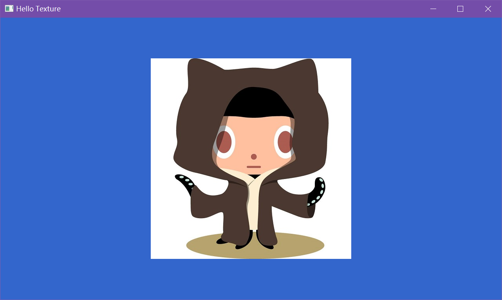

# D3D12-Texture
## 使用D3D12的纹理来显示一张图片，图片的格式可以是WIC支持的任意格式

```
float x = m_img.width / (float)m_width;
float y = m_img.height / (float)m_height;
m_aspectRatio = 1.f;
Vertex triangleVertices[] =
{
	{ { -x, -y * m_aspectRatio, 0.0f },		{ 0.f, 1.0f } },	//左下
	{ { -x, y * m_aspectRatio, 0.0f },		{ 0.f, 0.0f } },	//左上
	{ { x, -y * m_aspectRatio, 0.0f },		{ 1.f, 1.0f } },	//右下
	{ { x, y * m_aspectRatio, 0.0f },		{ 1.f, 0.0f } },	//右上
};
```
此处代码计算的是图片居中时候的矩形